# Omarchy site redesign

A keyboard-first static redesign of [omarchy.org](https://omarchy.org) — the public site for [Omarchy](https://github.com/omacom/omarchy), DHH's opinionated Arch Linux + Hyprland distro.

Hard edges, no shadows, no blur. JetBrains Mono everywhere. Six live palettes you can cycle with a single key. The extras gallery is the star of workspace 3.

  

  <a href="https://russelllobo.github.io/omarchy-redesign/"><strong>Live demo</strong></a>
  ·
  <a href="https://omarchy.org">Official site</a>
  ·
  <a href="https://github.com/omacom/omarchy">Omarchy OS</a>

This is an unofficial visual redesign of the website, not the operating system.

## Live palettes

Press <kbd>t</kbd> / <kbd>T</kbd> to cycle. Pick one from the menu (<kbd>Space</kbd>), or click the palette chip in the waybar. The choice is remembered.

  
  

  
  

  
  

**Tokyo Night** is the default: cool navy, lavender type, electric blue. **Gruvbox** is warm earth. **Catppuccin** is pastel mocha. **Everforest** is moss and tea. **Ristretto** is espresso and rose. **Kanagawa** is ink and wave.

Every color is a semantic token, so switching palettes recolors the waybar, menu, help overlay, news, people grids, and theme cards in one pass.

## Extra themes gallery

Workspace **3** is the extras page: community Omarchy desktop themes, installable from the OS menu.

  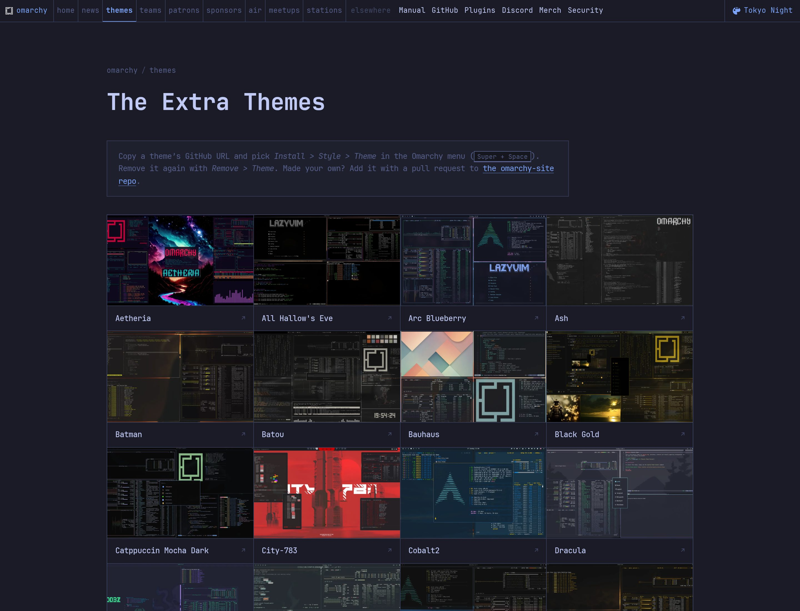

Copy a theme's GitHub URL, then in Omarchy: **Install → Style → Theme** (<kbd>Super</kbd>+<kbd>Space</kbd>). Remove with **Remove → Theme**.

  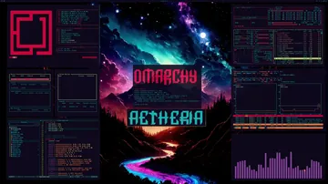
  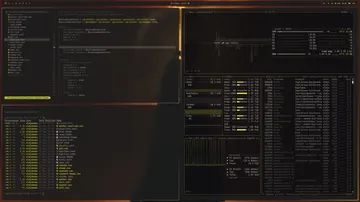
  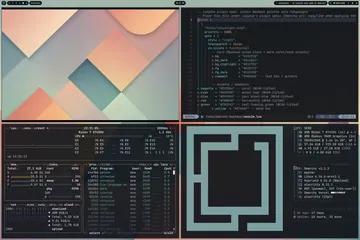

  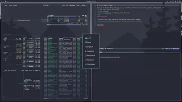
  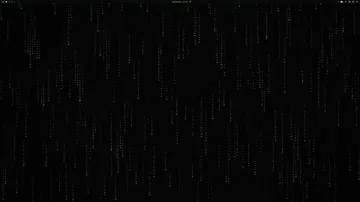
  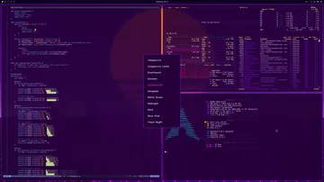

  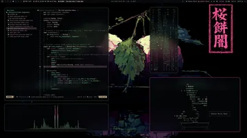
  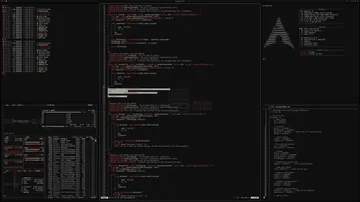
  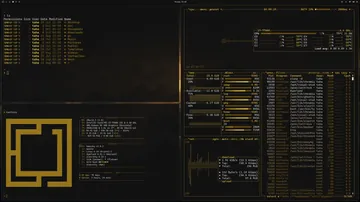

  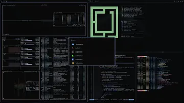
  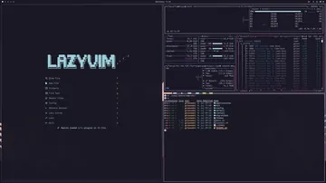
  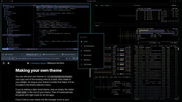

Thirty-five extras sit in the gallery, including Aetheria, All Hallow's Eve, Arc Blueberry, Ash, Batman, Batou, Bauhaus, Black Gold, Catppuccin Mocha Dark, City-783, Cobalt2, Dracula, Eldritch, Evergarden, Flexoki Dark, Gold Rush, Gruvbox Material, Hinterlands, Matrix, Midnight, Monokai, NES, Noir, Oxo Carbon, Ristretto Light, Rose Pine Dark, Rose Pine Moon, Sakura Mochi, Shades of Jade, Solarized, Synthwave '84, Tokyo Night OLED, Velvet Night, and VHS 80.

The AIR residents — HANCORE, OldJobobo, and Taha — account for a large share of the extras, plus several themes that already ship with Omarchy.

## The rest of the site

The chrome is a waybar. Pages are workspaces **1–9**. Everything else lives in the Omarchy menu.

  
  

<kbd>Space</kbd> opens the menu. <kbd>1</kbd>–<kbd>9</kbd> jump workspaces. <kbd>t</kbd> / <kbd>T</kbd> cycle palettes. <kbd>?</kbd> shows hotkeys. <kbd>Esc</kbd> closes anything.

  
  

  
  

  

Home is the ASCII mark, install line, videos, and latest news. Then news, extra themes, teams, patrons, sponsorships, artists in residence, meetups, and the workstations wall.

## Run it locally

No framework, no npm, no bundler. Python 3 for the tiny page builder; a static server for preview. Run `python3 build.py`, then `python3 -m http.server 8765`, and open [http://127.0.0.1:8765](http://127.0.0.1:8765). Edit files under `pages/` and `partials/`, rebuild, refresh.

`build.py` is a short concat. Pages declare a title, description, and workspace number; the builder stitches head, waybar, body, footer, and overlays, then writes the matching public HTML. Source lives in `pages/` and `partials/`. One stylesheet holds the six palettes. Scripts handle the menu, themes, hotkeys, and logo etch.

## Taste

Hard edges, no shadows, no blur, monospace everywhere, separation by space and line, one coherent semantic theme, delight without latency.

Motion stays under 150ms. Workspace jumps are instant. The homepage mark is the Omarchy ASCII, etched once with Web Text Effects; reduced-motion users get the still glyph.

Omarchy, the OS, and omarchy.org belong to [Omacom](https://omarchy.org). This repo is a personal redesign of the public site.
