# Omarchy site redesign

A keyboard-first static redesign of [omarchy.org](https://omarchy.org) — the public site for [Omarchy](https://github.com/omacom/omarchy), DHH's opinionated Arch Linux + Hyprland distro.

Hard edges, no shadows, no blur. JetBrains Mono everywhere. Six live palettes you can cycle with a single key.

<p align="center">
  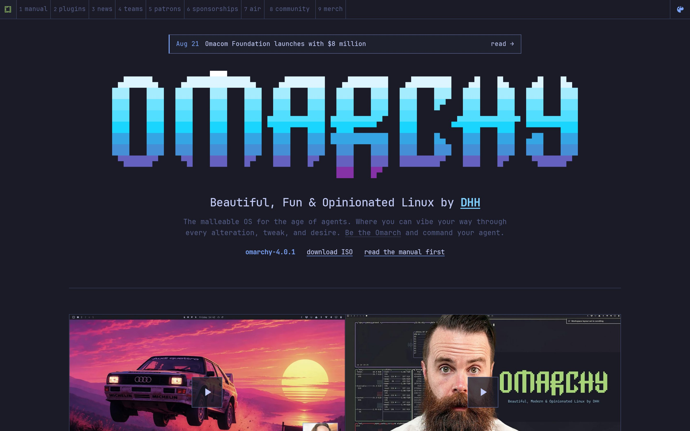
</p>

<p align="center">
  <a href="https://russelllobo.github.io/omarchy-redesign/"><strong>Live demo</strong></a>
  ·
  <a href="https://omarchy.org">Official site</a>
  ·
  <a href="https://github.com/omacom/omarchy">Omarchy OS</a>
</p>

This is an unofficial visual redesign of the website, not the operating system.

## Live palettes

Press <kbd>t</kbd> / <kbd>T</kbd> to cycle. Pick one from the menu (<kbd>Space</kbd>), or click the palette chip in the waybar. The choice is remembered.

<p align="center">
  
  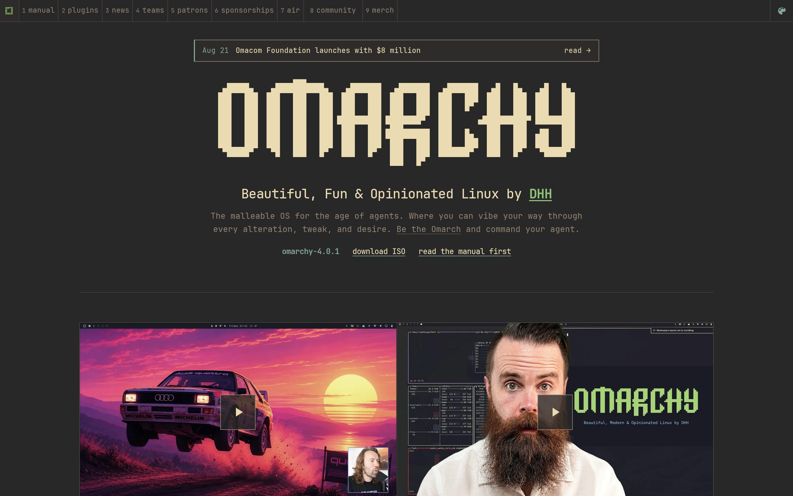
</p>
<p align="center">
  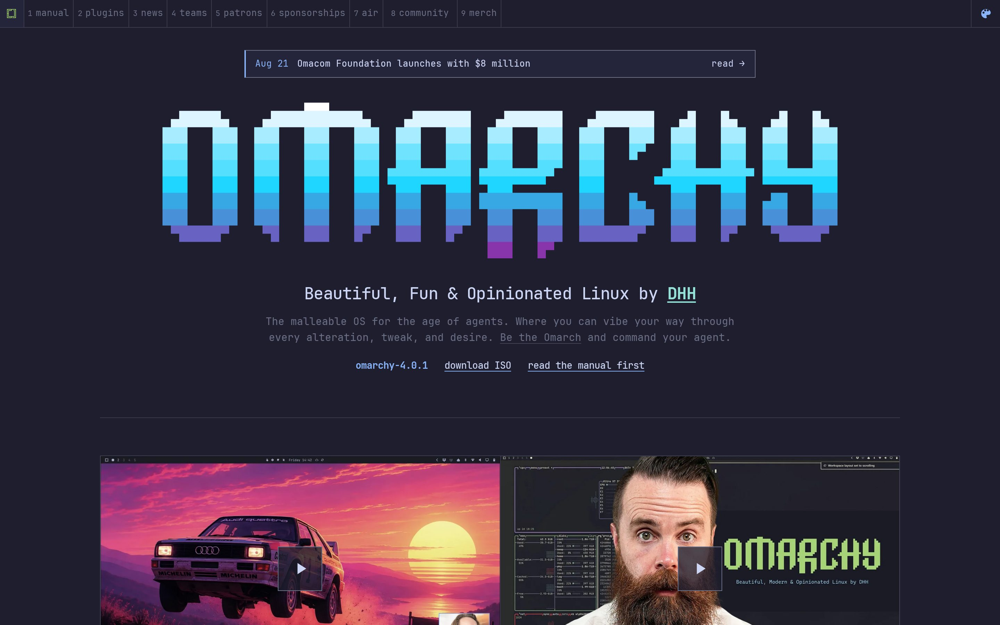
  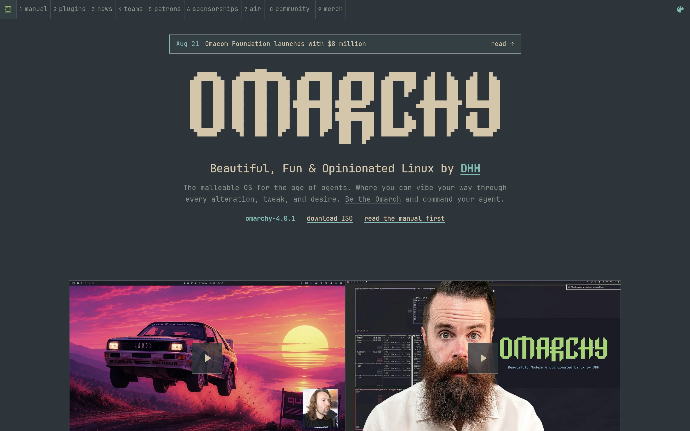
</p>
<p align="center">
  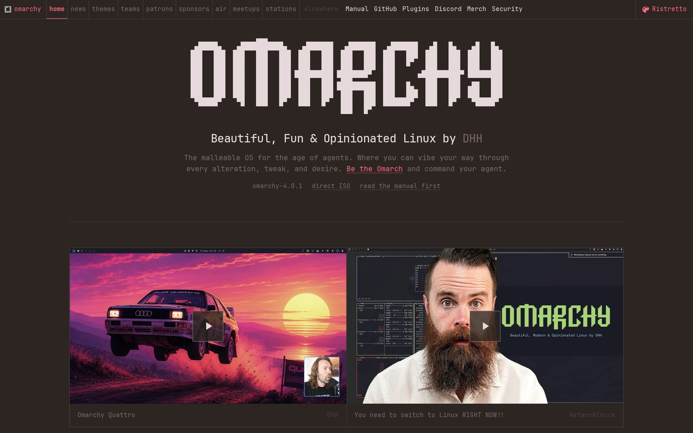
  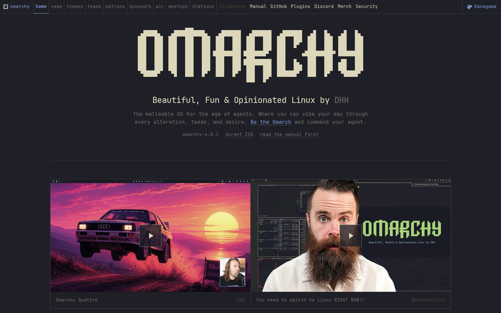
</p>

**Tokyo Night** is the default: cool navy, lavender type, electric blue. **Gruvbox** is warm earth. **Catppuccin** is pastel mocha. **Everforest** is moss and tea. **Ristretto** is espresso and rose. **Kanagawa** is ink and wave.

Every color is a semantic token, so switching palettes recolors the waybar, menu, help overlay, news, and people grids in one pass.

## The rest of the site

The chrome is a waybar. Home is the mark. Workspaces **1–9** are manual, plugins, news, teams, patrons, sponsorships, air, community, and merch. Everything else lives in the Omarchy menu.

<p align="center">
  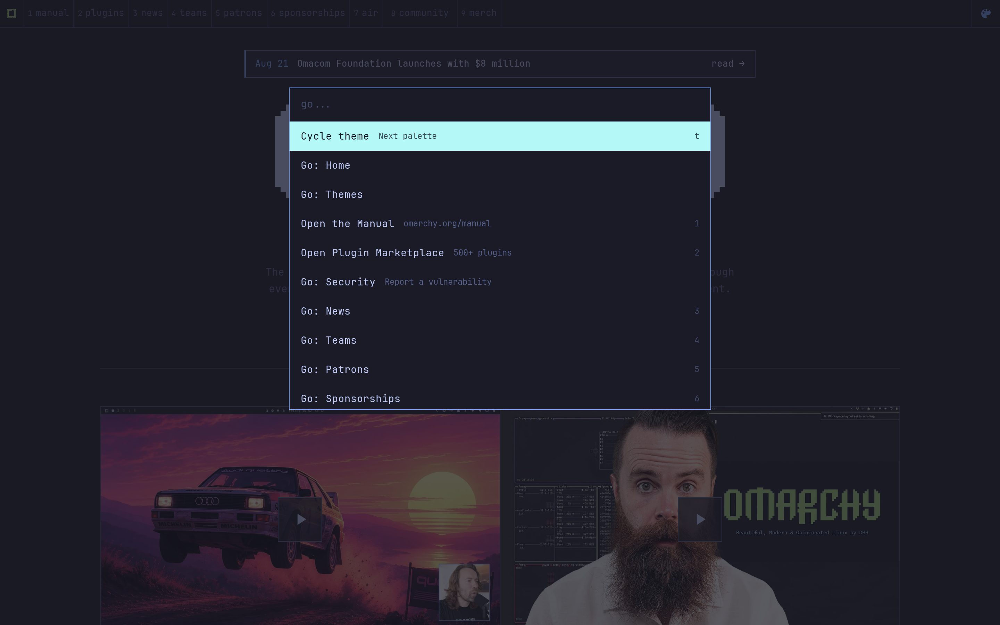
  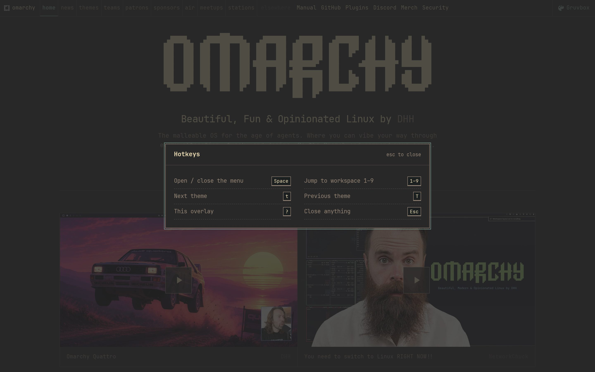
</p>

<kbd>Space</kbd> opens the menu. <kbd>1</kbd>–<kbd>9</kbd> jump workspaces. <kbd>t</kbd> / <kbd>T</kbd> cycle palettes. <kbd>?</kbd> shows hotkeys. <kbd>Esc</kbd> closes anything.

<p align="center">
  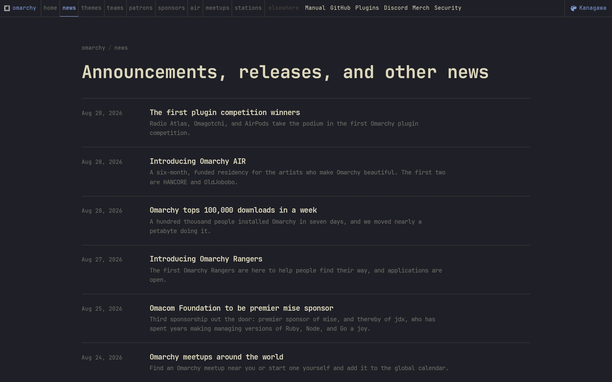
  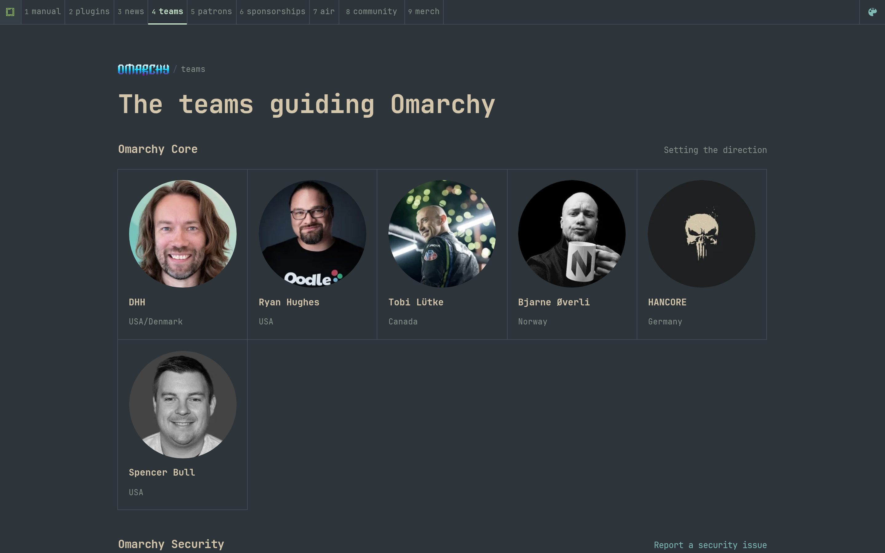
</p>
<p align="center">
  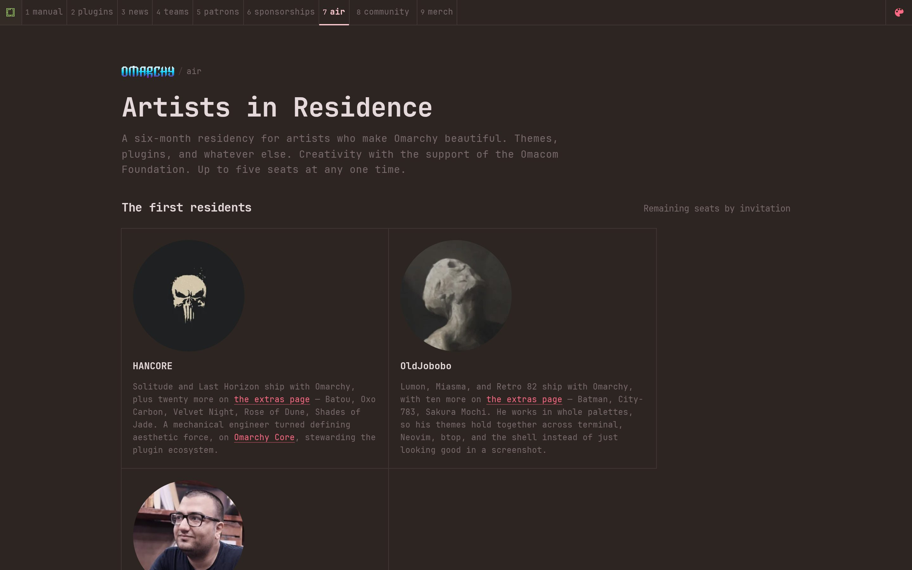
  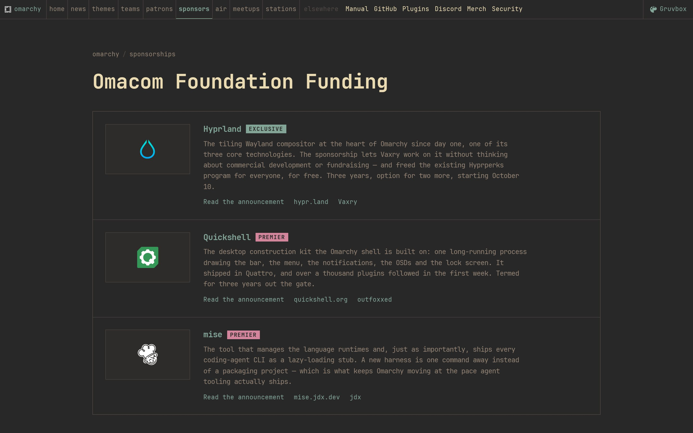
</p>
<p align="center">
  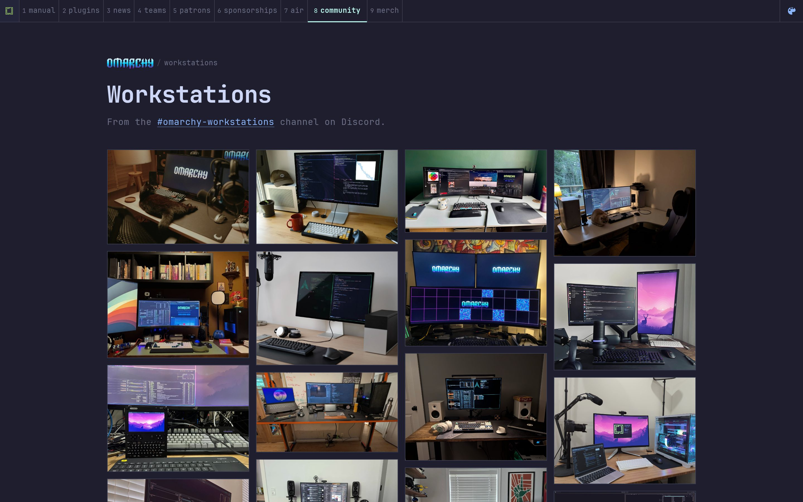
</p>

Home is the ASCII mark, install line, videos, and latest news. Then news, teams, patrons, sponsorships, artists in residence, and the workstations wall.

## Taste

Hard edges, no shadows, no blur, monospace everywhere, separation by space and line, one coherent semantic theme, delight without latency.

Motion stays under 150ms. Workspace jumps are instant. The homepage mark is the Omarchy ASCII, etched once with Web Text Effects; reduced-motion users get the still glyph.

## Weight

A typical page is about **80 KB** over the wire and the heaviest is **376 KB**, down from 293 KB and 4.3 MB. `python3 tools/weigh.py` prints the current table.

Four things keep it there:

- **Images are cut to the slots they land in.** The wall and theme grid paint into ~260 CSS px, so `tools/optimize_images.py` re-encodes each source into a small WebP ladder and `build.py` wires up `srcset`, letting a 1x display take the small file. Rungs sit ~1.35x above the slot: at render size that buys far more fidelity per byte than turning up the encoder quality.
- **Fonts are subset.** `tools/subset_fonts.py` cuts JetBrains Mono to Latin plus the punctuation and block elements the ASCII mark needs, and drops the three faces the stylesheet never asks for. 650 KB of woff2 became 87 KB.
- **The decorative modules load on demand.** The laser etcher is ~200 KB of wasm for one pass, so it is fetched at idle, only on the homepage, and skipped entirely under Save-Data, slow connections or reduced motion. The still glyph is the fallback.
- **The build fills in the boring parts.** Every `` gets intrinsic `width`/`height` and `decoding="async"`, and every asset URL gets one canonical content hash, so nothing shifts on load and nothing is fetched twice under two spellings.

Regenerating imagery is destructive by design — the originals live in git, not a stash directory:

```bash
git checkout -- assets/img && find assets/img -name '*@*.webp' -delete
python3 tools/optimize_images.py && python3 build.py
```

Omarchy, the OS, and omarchy.org belong to [Omacom](https://omarchy.org). This repo is a personal redesign of the public site.
